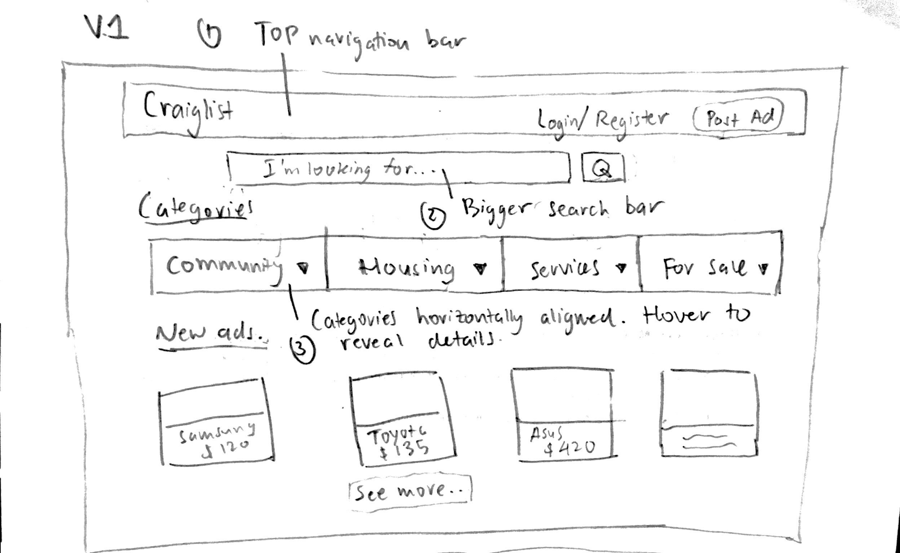
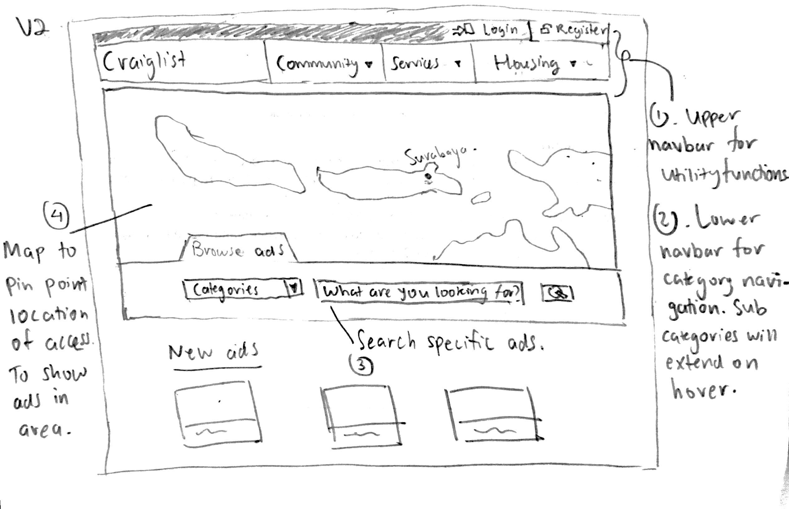
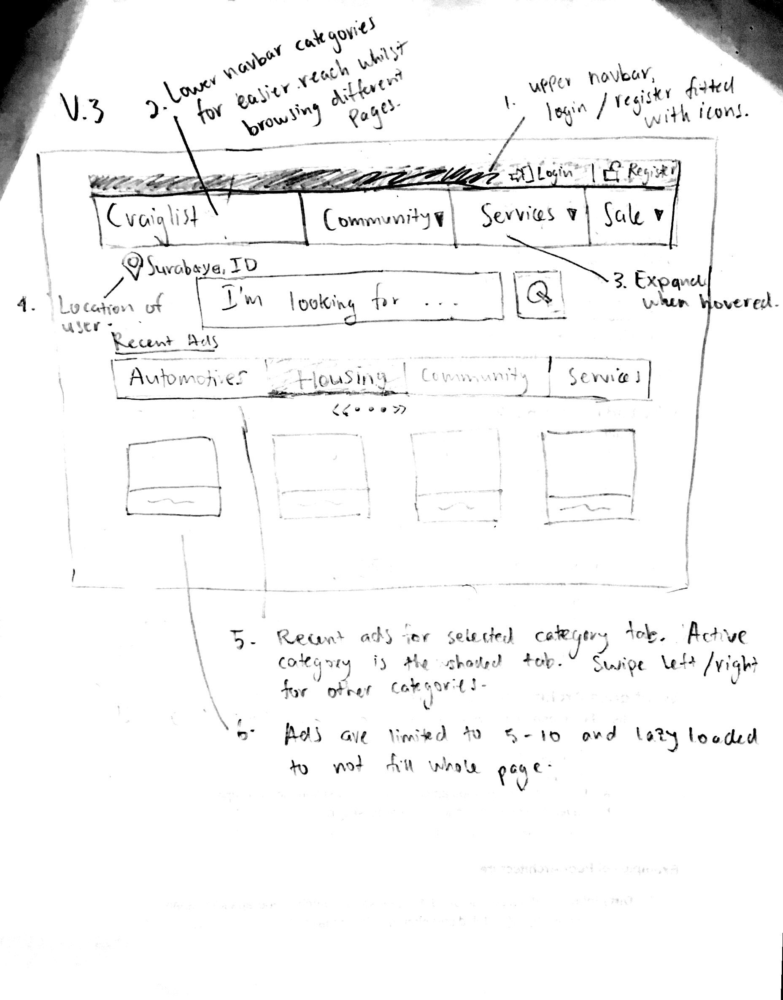
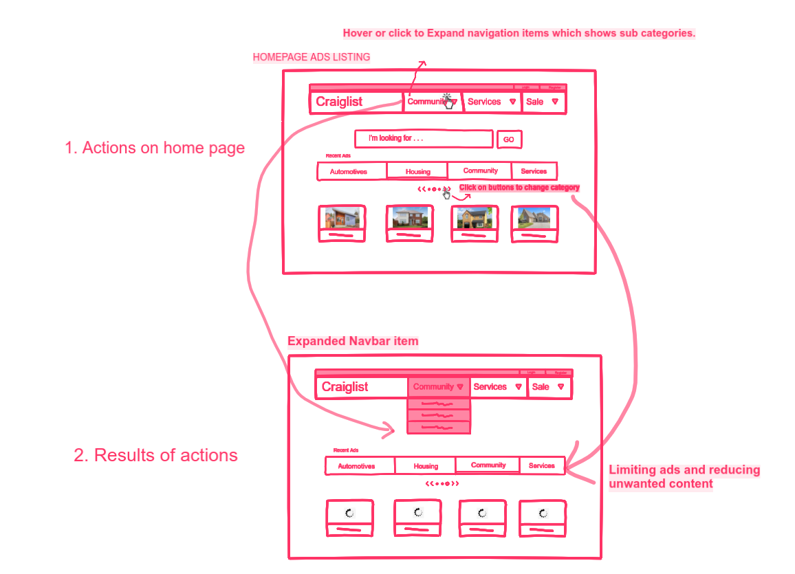
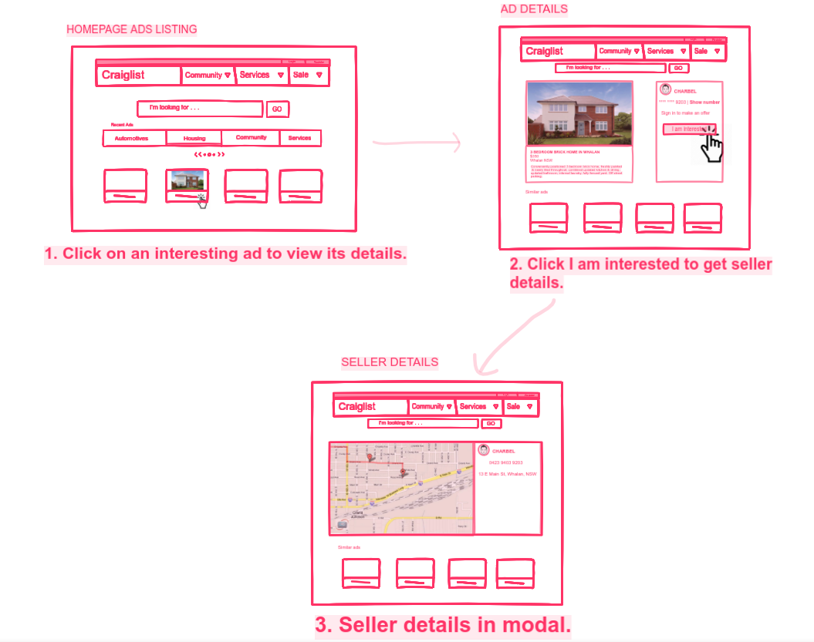
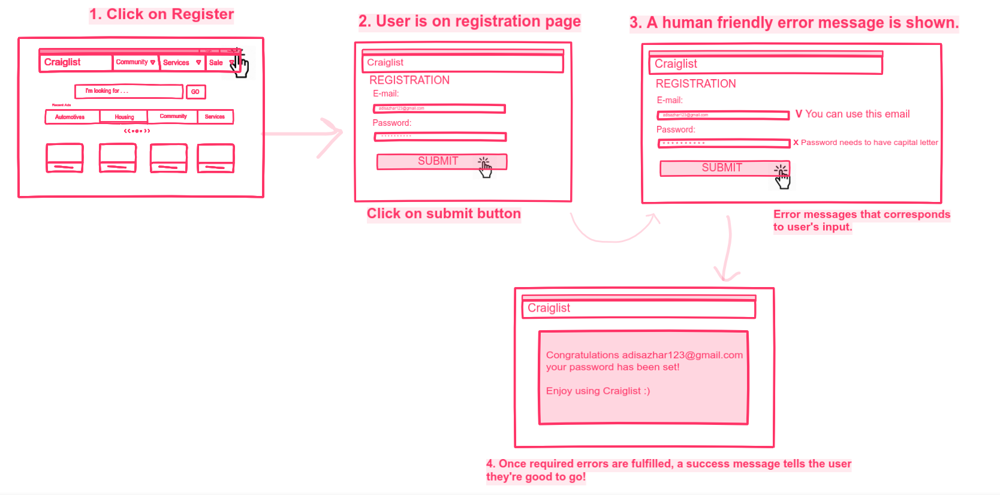

# Sketching and Prototyping
Using the information in the results of Assignment 1 for what is good and bad about the UI for designed tasks, we are going to make **Sketches** and **Prototypes**. These sketches and prototypes will lead to better design in Assignment 3. The prototypes will be then tested through a usability evaluation followed by design revision in Assignment 4.

## Part A: Sketches
Sketch at least **3 (three)** different UIs for the functions you are targeting. These three interfaces should be _dramatically different_ in terms of design directions. For example, they can be with different organizations of what functions on each screen or using a different layout of the icons, widgets, and menus on the screens. If you want, you can also incorporate non-on-screen UIs: physical buttons, gestures through motion sensors, etc.

You need **not** sketch the whole interface. It is not necessary for the sketches to have every function or every function in detail, but there should be enough to show off your general idea. **Be creative!** Draw your idea and label a few of the widgets so we can tell your intent. The goal is to have at least 3 good UIs in *interesting* ways. Sketches should be done on paper with pens and/or pencils (do not use a computer).

### 1. Scan/Photo of Sketches
**V1**

Image 1: V1 sketch
**V2**

Image 2: V2 sketch
**V3**

Image 3: V3 sketch

### 2. Version Differences
All versions are an improvement of the current Craiglist homepage. Each of the versions have component similarity such as Navbar and Cards, but differentiates in positioning, icons, and behavior of components. The navbar of each version is to provide ease for the user when they want to change categories. Current Craiglist app lacks a base Navbar. It is only shown on the home page.
Note that homepage is mostly composed of For Sale categories, other Craiglist section, such as Forums, are located in sub menus, user has to be logged in etc. to not expose explicit content publicly. I will explain my reasons in part B.

Status Quo:
- Homepage is full of small text and components bunched together, unstrategic location of important UIs: search bar is on the left, with other nav items, and all categories are shown on 1 page.

Solutions: 

- V1 has a single Navbar with Login/ Register and Post Ad button.

- V2's Vavbar is split to an upper and lower. Upper Navbar is for utility function Login and Register, and lower have Navbar items which represent categories. Sub categories will expand on hover. In the middle is a map to show the user's location and selected site, because different city have different sites. The search bar is supported with the category it should search in. Last, all new ads are shown on the bottom.

- V3's is a revision of V2. The difference lies in the location information, which is only a label. Why? A map just to show the user's location is overhead, and fills the page too much. A text is adequate to fulfill the function. In addition to that, the ads on the bottom are specific to category selected shown in the horizontally aligned tabs. The selected category tab has a darker shade. This is so that the homepage will not be filled with ads that user isn't interested in, and also to improve load time.

### 3. Selected Sketch
I chose V3 because it has the base functionality of V1 and V2 but has been refined. Such as the selected category tabs, location label, and Navbar.

### 4. Design Rationale
I have learnt from the contextual inquiry that:
1. Users are easily bored. Boredom comes from interfaces that are too dull. In my design, I have added card like component, images, sliding effect, and larger text.
2. Not all users have the same interests. An ad listing that shows up may be spam for the user. An option to change ad listing categories on the first page is provided so the users can choose their interest.
3. User had to visit homepage to re-chose category. The existence of Navbar in the proposed design can help user to re-choose category on any page.
## Part B: Assumptions
### 1. Hardware
The new Craiglist design will run adequately on the following specifications:
**Mobile:**
- Touch screen capability
- Minimum of 4.5 inches
- RGB support screen
- GPS module working
- 2 Gb of RAM
  
**PC:**
- Minimum screen size of 13 inches
- Minimum resolution of 1366 x 768
- RGB support screen
- Availability of mouse and keyboard for input
- 2 Gb of RAM

### 2. Users
The target audience of the new Craiglist design will accomodate users of teenagers and adults, from 16 years to 50 years of age. I think that the experience of users are arbritrary, but to the very minimum, an understanding of operating computer and mobile devices is needed. If the user can atleast browse the internet, then it will conclude they will survive using Craiglist.

Older users tend to have sight impairment, therefore it will be in consideration to have bigger component sizes for easy viewing. Or an option to change text sizes.

For users on the younger spectrum, the design will be more descriptive. I am aware that some parts of Craiglist isn't universally suited for all age groups. Menus for content other than buy/ sell products will be harder to each, nested in different submenus. It will label parts that may lead into explicit content, and provide dialog warnings to continue use of site.

<!-- The old design of Craiglist had very unstrategic size and positioning of components. -->

## Part C: Prototypes
We will work on this part together during the class on **March 22nd, 2019**, 10:00 AM - 12.30 PM. Therefore, prior to the class please complete all the above parts (A & B) beforehand accordingly.

**Homepage**

Image 4: Actions that can be done on the homepage

**Ad Details**

Image 5: Actions that can be done on the ad page

**Register**

Image 6: Clear error message during registration

**High Fidelity** [Updated]
https://invis.io/HRRCNFLXCSV#/355978309_Home